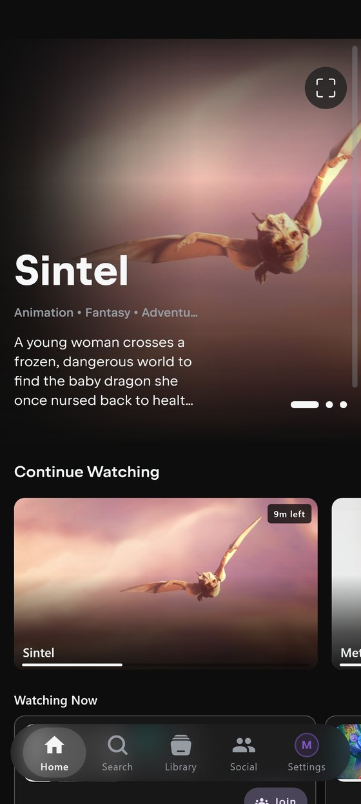
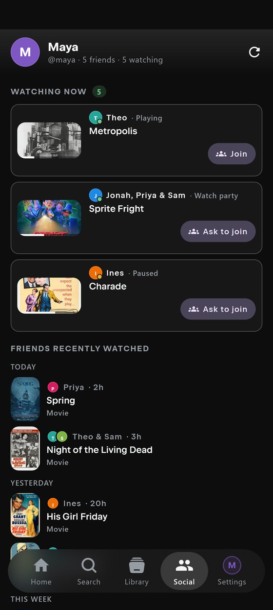
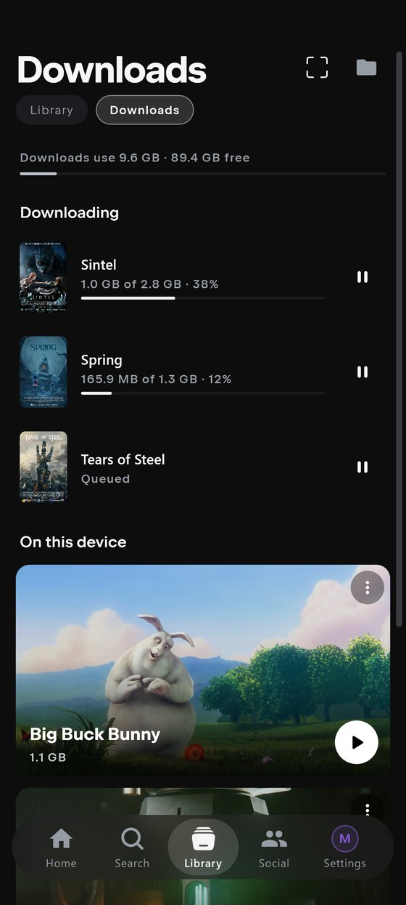

<div align="center">

  
  <br />
  <br />

  [![Contributors][contributors-shield]][contributors-url]
  [![Forks][forks-shield]][forks-url]
  [![Stargazers][stars-shield]][stars-url]
  [![Issues][issues-shield]][issues-url]
  [![License][license-shield]][license-url]

  <p>
    <b>Nuvio Z</b> is a community-maintained mod of
    <a href="https://github.com/NuvioMedia/NuvioMobile">Nuvio</a> for Android and iPhone,
    with its own playback modes, rebuilt Downloads, Social and Watch Together.
    <br />
    <i>Looking for Windows or macOS? See <a href="https://github.com/Zokaper/NuvioZDesktop">Nuvio Z Desktop</a>.</i>
  </p>

</div>

## What is Nuvio Z?

[Nuvio](https://github.com/NuvioMedia/NuvioMobile) is a free, open-source media app from
NuvioMedia. You bring your own sources, and Nuvio turns them into a library with artwork, ratings,
subtitles and synced watch progress.

**Nuvio Z is a mod built on top of Nuvio.** It keeps the Nuvio you already know, follows
upstream's releases, and adds a set of features, workflows and fixes of its own. The Android and
iPhone apps in this repository share their code, and the [Windows and macOS
app](https://github.com/Zokaper/NuvioZDesktop) is built to feel like the same product on a
computer.

- **It's Nuvio underneath.** Everything Nuvio ships arrives by inheritance, and every Nuvio Z
  release names the Nuvio release it was built on. *Nuvio Z 0.5.4-z1 is built on Nuvio 0.5.4-beta.*
- **Z adds its own things.** Playback modes that choose a source for you, a rebuilt Downloads
  system with offline playback, Social and Watch Together, and a redesigned setup. The full list
  is in [`Docs/Z-FEATURES.md`](./Docs/Z-FEATURES.md).
- **It's a separate app.** Nuvio Z installs next to Nuvio rather than over it, and keeps its own
  sign-in on a device that has both.
- **It isn't official.** Nuvio Z is not affiliated with or endorsed by NuvioMedia. If you hit a
  bug, report it here, not to upstream, unless you can reproduce it in Nuvio itself.

## Features

**Playback that does the picking.** Choose how much you want to be asked. *Classic* shows every
source and lets you choose. *Streamlined* asks one question, what quality you want, and picks the
best release in it. *Instant* asks nothing: it checks your connection and plays what it can
actually carry. The quality picker is built from the releases a title really has, and a loading
screen shows what's happening and moves to the next source on its own if one fails. Long-press an
episode for the full source list in any mode.

**Downloads that work offline.** Download a movie, an episode or a whole season in *Automatic*,
*Assisted* or *Manual* mode, with size levels shown in GB per hour so you know what a season will
cost before it starts. A *Needs you* list says what's stuck and offers the fix. Downloaded titles
become a library that plays with no connection at all. On Android, downloads run in the background
with a progress notification. On iPhone, a season keeps downloading with the phone locked.

**Social.** Add friends by handle, see what they're watching now and what they recently finished,
and ask to join with one tap. You choose what friends can see, and the whole thing is opt-in: turn
Social off and the tab, the rows and Watch Together go away.

**Watch Together.** Start a party from whatever you're playing and watch in sync with friends on
Android, iPhone or [desktop](https://github.com/Zokaper/NuvioZDesktop). Everyone plays through
their own sources, so nobody shares an account or a link. The host can keep control or share it,
and anyone who switches apps or locks their phone shows as *Away* instead of looking like a
stalled stream.

**Setup and personalization.** First-time setup walks you through playback, downloads, language,
sources and Social, with a live preview of what each choice changes. If you don't have a source
yet, it can set up a recommended AIOStreams + TorBox one. *Advanced Setup* covers everything else
and can be reopened any time. Shared profile preferences follow you between devices, while
device-specific ones, like navigation and player controls, are set up on each device. Pick your
navigation style, themes, and which settings you see.

**Tracking and metadata.** MDBList for watched history, library and Rotten Tomatoes scores. Cast,
artwork and episode details from TMDB out of the box. Intro and credits skipping where it's known,
subtitle choices that carry to the next episode, custom poster images (advanced).

**Sources.** Nuvio Z does not provide content. You add sources, the same Stremio-style addons Nuvio
uses, and Nuvio Z ranks and plays what they return.

<table>
  <tr>
    <td></td>
    <td></td>
    <td></td>
  </tr>
</table>

<sub>Screenshots are renders of the app's real screens with sample content. Artwork is from freely
licensed films; credits are in [`Docs/images/readme/CREDITS.md`](./Docs/images/readme/CREDITS.md).</sub>

## Platforms

Nuvio Z is one product on two codebases, released separately.

| | Platforms | Repository |
| --- | --- | --- |
| **Mobile** (this repository) | Android 7.0+ · iPhone, iOS 16.1+ | [`Zokaper/nuvio-z`](https://github.com/Zokaper/nuvio-z) |
| **Desktop** | Windows · macOS | [`Zokaper/NuvioZDesktop`](https://github.com/Zokaper/NuvioZDesktop) |

Social and Watch Together work across mobile and desktop, so a party can mix a phone and a computer.

## Install

### Android

1. Open the [latest release](https://github.com/Zokaper/nuvio-z/releases/latest).
2. Download **`Nuvio-Z-Android-arm64-v8a-…apk`**. That is the right file for almost every modern
   phone. The `armeabi-v7a`, `x86` and `x86_64` builds are there for older and unusual devices.
3. Open it, and allow your browser or file manager to install apps if Android asks.

Nuvio Z updates itself from inside the app, so you only do this once.

### iPhone

Nuvio Z isn't on the App Store or TestFlight. On iPhone it installs through
[SideStore](https://sidestore.io), which signs the app with your own Apple Account and refreshes it
wirelessly. You'll need an iPhone on iOS 16.1 or later, a free Apple Account and a USB cable.

**First time on an iPhone: use Nuvio Z iOS Setup.** It's a small app for Windows and macOS that sets
everything up with you. It checks your computer, notices your iPhone, and ticks off each step by
itself as it sees it happen:

1. Download **Nuvio Z iOS Setup** for your computer. These links always give you the newest version:
   - [Windows (x64)](https://github.com/Zokaper/nuvio-z/releases/download/ios-setup-vlatest/Nuvio-Z-iOS-Setup-Windows-x64.zip)
   - [macOS](https://github.com/Zokaper/nuvio-z/releases/download/ios-setup-vlatest/Nuvio-Z-iOS-Setup-macOS.zip)

   Extract it and run the app. There's nothing to install. Windows may show a SmartScreen notice
   (*More info → Run anyway*); on a Mac that blocks it, use *System Settings → Privacy & Security →
   Open Anyway*. The macOS version hasn't been tested on real hardware yet. Checksums and older
   versions are on the [setup release page](https://github.com/Zokaper/nuvio-z/releases/tag/ios-setup-vlatest).

   *Nuvio Z iOS Setup has its own version number and release line, separate from the Nuvio Z app.*
   <!-- These links use the rolling ios-setup-vlatest prerelease, which the "Build iOS Setup GUI"
        workflow refreshes on every setup release (run it with publish_tag), so they never need
        bumping. Do not use /releases/latest: that resolves to the Nuvio Z app release, and setup
        releases are pre-releases. -->
2. Follow the checklist. The app downloads what it needs (a verified copy of iloader and, on
   Windows, Apple's iPhone drivers), then guides you through connecting and trusting your iPhone,
   installing LocalDevVPN and SideStore, allowing SideStore's notifications, and adding the Nuvio Z
   source by scanning a QR code with your iPhone camera. Your Apple sign-in happens in iloader and
   SideStore; the app never sees your password, and it works out where you left off if you stop
   halfway.

**Already have SideStore set up?** Add the Nuvio Z source in SideStore and install Nuvio Z from
it:

```
https://raw.githubusercontent.com/Zokaper/nuvio-z/main/distribution/sidestore/source.json
```

**Prefer to do it by hand?** Each release has an unsigned IPA
(`Nuvio-Z-iOS-…-unsigned.ipa`) that you can sideload with the tool of your choice.

**Updates** arrive through SideStore, which shows an *Update* badge next to Nuvio Z. Keep
SideStore and LocalDevVPN set up so it can refresh the app. Signing limits and troubleshooting are
in [`distribution/sidestore/README.md`](./distribution/sidestore/README.md).

## Development

```bash
git clone https://github.com/Zokaper/nuvio-z.git
cd nuvio-z
./scripts/run-mobile.sh android   # or: ios (macOS + Xcode)
```

Project layout, Gradle tasks, tests, versioning and release notes are in
[`Docs/DEVELOPMENT.md`](./Docs/DEVELOPMENT.md). Please read [`CONTRIBUTING.md`](./CONTRIBUTING.md)
before opening an issue or pull request.

The documents that explain how the mod relates to Nuvio:
[`Docs/Z-FEATURES.md`](./Docs/Z-FEATURES.md) (every Z feature and the platforms it's on),
[`Docs/UPSTREAM.md`](./Docs/UPSTREAM.md) (how Z tracks upstream and is versioned) and
[`Docs/PATCH-SURFACE.md`](./Docs/PATCH-SURFACE.md) (every upstream file it changes).

## Upstream & License

Nuvio Z is a modification of [Nuvio](https://github.com/NuvioMedia/NuvioMobile) by NuvioMedia, and
would not exist without it. Upstream's authors hold the copyright in the code Nuvio Z inherits.

Both Nuvio and Nuvio Z are licensed under the **GNU General Public License v3.0**. See
[LICENSE](./LICENSE). Nuvio Z is distributed under the same terms, with source available.

Nuvio Z is not affiliated with or endorsed by NuvioMedia. Please do not report Nuvio Z bugs to
upstream unless you can also reproduce them in Nuvio.

## Legal & DMCA

Nuvio functions solely as a client-side interface for browsing metadata and playing media provided by user-installed extensions and/or user-provided sources. It is intended for content the user owns or is otherwise authorized to access.

Nuvio is not affiliated with any third-party extensions, catalogs, sources, or content providers. It does not host, store, or distribute any media content.

For comprehensive legal information, including our full disclaimer, third-party extension policy, and DMCA/Copyright information, please visit our [Legal & Disclaimer Page](https://nuvioapp.space/legal).

## Built With

Kotlin Multiplatform · Compose Multiplatform · AndroidX Media3 · AVFoundation and native iOS
integrations

## Star History

<a href="https://www.star-history.com/#Zokaper/nuvio-z&type=date&legend=top-left">
 <picture>
   <source media="(prefers-color-scheme: dark)" srcset="https://api.star-history.com/svg?repos=Zokaper/nuvio-z&type=date&theme=dark&legend=top-left" />
   <source media="(prefers-color-scheme: light)" srcset="https://api.star-history.com/svg?repos=Zokaper/nuvio-z&type=date&legend=top-left" />
   
 </picture>
</a>

<!-- MARKDOWN LINKS & IMAGES -->
[contributors-shield]: https://img.shields.io/github/contributors/Zokaper/nuvio-z.svg?style=for-the-badge
[contributors-url]: https://github.com/Zokaper/nuvio-z/graphs/contributors
[forks-shield]: https://img.shields.io/github/forks/Zokaper/nuvio-z.svg?style=for-the-badge
[forks-url]: https://github.com/Zokaper/nuvio-z/network/members
[stars-shield]: https://img.shields.io/github/stars/Zokaper/nuvio-z.svg?style=for-the-badge
[stars-url]: https://github.com/Zokaper/nuvio-z/stargazers
[issues-shield]: https://img.shields.io/github/issues/Zokaper/nuvio-z.svg?style=for-the-badge
[issues-url]: https://github.com/Zokaper/nuvio-z/issues
[license-shield]: https://img.shields.io/github/license/Zokaper/nuvio-z.svg?style=for-the-badge
[license-url]: https://github.com/Zokaper/nuvio-z/blob/main/LICENSE
